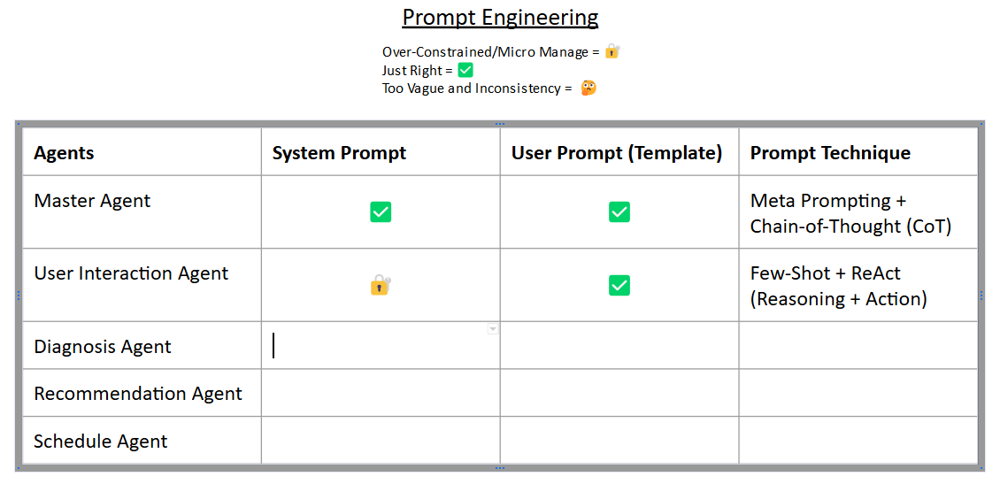

### Here Are Some Note Worthy Features
1. Reasoning Capabilities 
2. Multi-Agent Conversing and Facilitation (LangGraph)
3. Search Capabilities 
4. Vector Similarity Search (FAISS)
4. Hugging Face Integration (Recommendation System Agent)
5. Google Calendar Planning (Scheduler Agent)

### Some Problems You Might Run Into
- incorrect API key provided: three reasons: invalid key from the source, created api key may take a while to be active, the key is not reflective of the current key from the .env (consider restarting environment)

- parsing error: you can add handle_parsing_errors=True which allows the agent to handle any parsing issues

- the jupyter notebook test might not be updated due to failed cache, consider restarting the kernel

- tool does not support sync invocation : ensure that each tool returns a callable function rather than a None or String for synced invocation

- invalid reducer signature for StateGraph: ensure that the State is in the appropiate type

- self.report is not actually the report dict type itself, but an instance so make sure to re initialized when passed in 

- user_input: the master agent had access to the user_input tool but in this case it is too complicated 

- DEPRECIATION CRYYY

- HAHHAAHHAHAHAHA HAAHAHAHAH the output cell was empty but if you copy it there was acutal reasoning bruhhhhh

-- I SEEEEEEEEEEEE THE CREATE REACT AUTOMATICALLY HAS A HIDDEN TOOLS NAME AND TOOOLS, anD  SCRATCH PAD SO MAKE SURE THEY ARE IN THE PROMPT

- PDF OR IMAGES 
## Composition

#### PROBELMS FOR THE SAKE OF SIMPLICITY WE WILL NOT IMPLEMENT A DIAGNOSIS TEAM

CODE TOP BUT PROMPT ENGINEER BOTTOM UP

- IT is chronolgoical system but finetung laters 

## Thoguht Process 

- create a generic llm for better coding practice (give it the chance to create reasoning or regular agent)

- start from the top bottom approach, start from the master node and handling its work flow first

If there is uncertainty or they require further collaboration, a Secondary Coordinator Agent might be used to facilitate communication between specialists.

- use a agentstate to keep track of hte state of hte report

- OH SHOOT, CHATPROMPT USES PROMPT TEMPLATE AND TO INVOKE YOU FILL THESE IN BUT MAKE SURE IT IS IN A DICT

- ideally we add everythign to the prioir ddatabase

- only thing different about each agent is there tools and the agent type 

- CONTAINERIZATION

- Incorporates some use of knowledge graphs 

- Modularize the tools, maybe even having tool and within it (search tools | query tools | user interaction tool) 

## Further Implementation
- Subgraph In Diagnosis: Extend The Diagnosis Agent To Be A Sub Graph With Many Specialist Agent
- Efficient Vector Database Searching: Add A Tool That Extracts The MetaData of PDF So Query LookUp 'source' Would Be Filtered and Flexible Additional Without Recreation
- More Data: Create Folders For More Disciplines And Their Own Vector Database
- Deterministic Outputs: Implement Few Shot Learning (FSL)
- Tokenize the Documents: 
- HAVE DIFFERENT PROMPTING TECHNIQUES FOR DIFFERENT AGENTS
- Efficient Searching: Implementing A Caching System and Switch To Google But Search API Cost Money

## Resources

#### Prompting 

- [ChatPromptTemplate (MUST READ)](https://api.python.langchain.com/en/latest/prompts/langchain_core.prompts.chat.ChatPromptTemplate.html)

- [HumanPromptTemplate](https://api.python.langchain.com/en/latest/prompts/langchain_core.prompts.chat.HumanMessagePromptTemplate.html)

- [SystemMessage](https://api.python.langchain.com/en/latest/messages/langchain_core.messages.system.SystemMessage.html)

- [Prompt Techniques](https://www.promptingguide.ai/techniques)

#### Agent
- [CreateReactAgent](https://api.python.langchain.com/en/latest/agents/langchain.agents.react.agent.create_react_agent.html)
- [AgentExecutor](https://api.python.langchain.com/en/latest/agents/langchain.agents.agent.AgentExecutor.html#langchain.agents.agent.AgentExecutor)

##### Tools
- [Custom Tools](https://python.langchain.com/docs/how_to/custom_tools/)

##### LangGraph

- [LangGraph Thread](https://langchain-ai.github.io/langgraph/concepts/low_level/#threads)

#### Vector 

- [FAISS]

####
- [OTHERS](https://www.roro.io/post/7-practical-ways-to-prevent-llm-hallucinations-and-protect-your-product)

- WHY LANGGRAPH,IF YOU DEFINE THE SCOPE THEN EACH AGENT ARE ONLY RESPONSIBLE FOR THEIR OWN SPECIFC PART IN HE STATE RATHER CONSIDERING ALL THE DIFFERENT SCENARIO

-- FIX FOR MORE CONSISTENT FORMAT FOR SYSTEM, TEMPALTE, EXMAPLES

-- TODO 
- ADD SEARCH ENGINE AND TESTING AND EXMAPLES FOR IT
- NEED ROBUST TESTING

- RECOMMENDATION SHOULD BE RELIABLE AS POSSIBLE HENCE WE USE CDC, DIAGNOSIS NEEDS GATHER AS MUCH INFOMRATION

- Implement dynamic webscraping/ just realized that i couldv'e queried the url 