## OptiMed

OptiMed is a **Multi-Agent System** designed to replicate the workflow of a healthcare setting using **LangChain**. This system streamlines patient interactions by performing the following tasks:

1. **Patient Interaction**: Engages with patients to collect relevant information.
2. **Diagnosis**: Analyzes symptoms and provides a preliminary diagnosis.
3. **Treatment Recommendations**: Suggests treatments or actionable recommendations.
4. **Appointment Scheduling**: Facilitates scheduling follow-up appointments seamlessly.

### Key Features
---
Before diving into the code, here are some **key features** to note:

- **Customizable and Flexible Agent Creation**  
- **Integratable Tools for Various Agents**  
- **Reasoning Capabilities** (CoT, ReAct)  
- **Multi-Agent Collaboration** - *LangGraph* 
- **Hub and Spoke Model** 
- **Search Engine**  
- **Vector Database**  
- **Web Scraping**  
- **Google Calendar Scheduling**

### Workflow
---
Here is the workflow between agents using the Hub and Spoke Model

### Agent and Tools
---
- **Master Agent**: Facilitates and delegates tasks
    - **Respond Tool** (Needed for Verbose Reasoning)

- **Nurse Agent**: Interacts with the user to gather patient information and appointment details
    - **User Interaction Tool**

- **Diagnosis Agent**: Diagnoses the patient based on the patient information
    - **Search Database**
    - **Search Engine**

- **Recommendation Agent**: Provides treatment suggestions
    - **CDC Web Scraper**

- **Reception Agent**: Sets up appointments
    - **Parse Appointment**
    - **Schedule Appointment**

### Prompting
---
Here is the prompting technique employed by each agents:

### Worked Example
---
1. **Passes In Empty Template**

2. **Extract Patient Information**

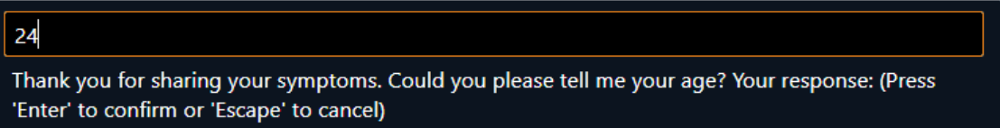

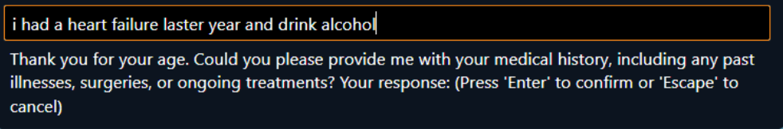

3. **Finds Diagnosis Using Tools**

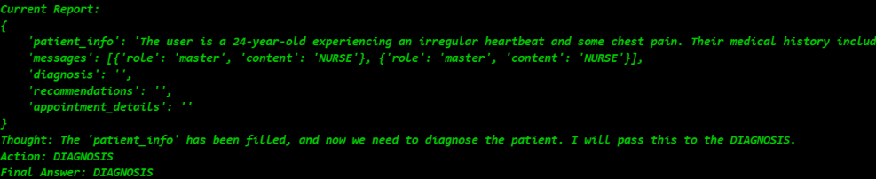

___

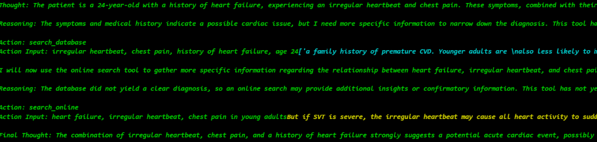

4. **Searches CDC Online**

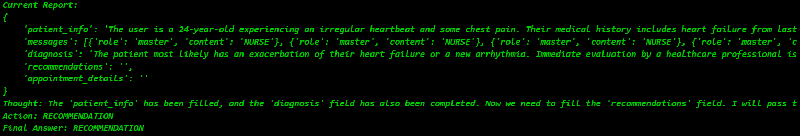

___

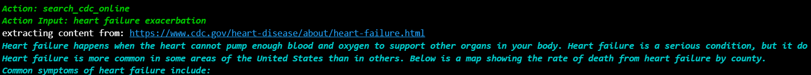

___

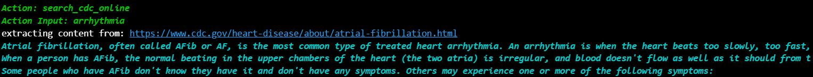

5. **Sets Up An Appointment**

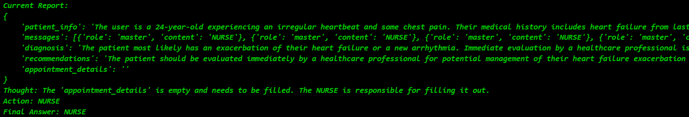

___

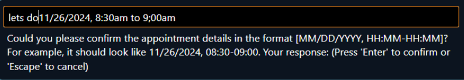

___

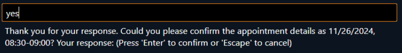

6. **Book An Appointment**

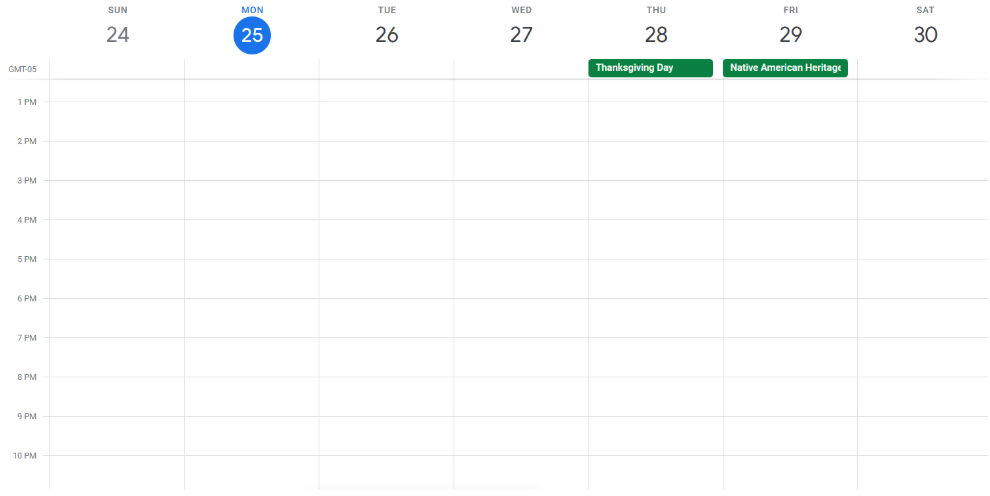

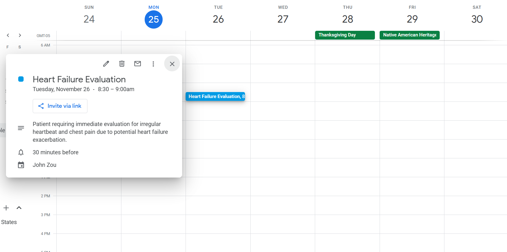

### Further Implementation
---
- **Subgraph in Diagnosis**: Extend the Diagnosis Agent to act as a subgraph, incorporating multiple specialist agents to provide more detailed and specialized diagnoses.

- **Efficient Vector Database Searching**: Add a tool that extracts metadata from PDFs, allowing query lookups by 'source'. This approach will enable flexible filtering without the need for database recreation.

- **Expand Data**: Create separate folders for different disciplines, each with its own dedicated vector database, to better organize and manage diverse healthcare data.

- **Deterministic Outputs**: Implement **Few-Shot Learning (FSL)** to ensure consistent and reliable results across similar queries, reducing the need for retraining.

- **Efficient Searching**: Implement a caching system to improve search speeds. Additionally, explore switching to Google’s Search API, considering its costs and balancing efficiency with budget.

- **PageRank for Better Relevance**: Integrate a PageRank-like algorithm to prioritize and rank search results, improving the relevance of returned information.

- **Robust Testing**: Finetune the prompts
